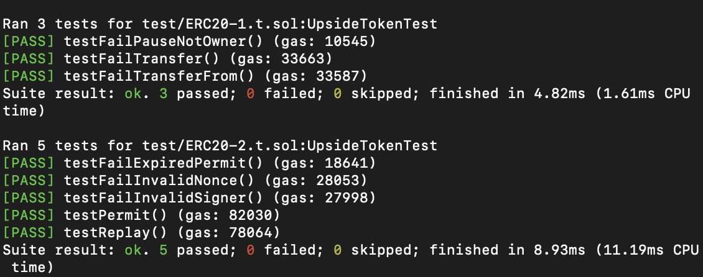

## 분석

### test1

```solidity
    function setUp() public {
        upside_token = new ERC20("UPSIDE", "UPS");
        upside_token.transfer(alice, 50 ether);
        upside_token.transfer(bob, 50 ether);
    }
```


- `UPSIDE`라는 이름과 `UPS` 라는 심볼을 가진 토큰을 생성
- `bob`과 `alice` 에게 50 ether씩 전송

```solidity
    function testFailPauseNotOwner() public {
        vm.prank(alice);
        upside_token.pause();
    }
```


- `alice` 가 pause를 시도하였으나 `owner` 가 아니기 때문에 `revert` 가 발생

```solidity
    function testFailTransfer() public {
        upside_token.pause();
        vm.prank(alice);
        upside_token.transfer(bob, 10 ether);
    }
```

- `pause` 가 걸려있기 때문에 토큰 전송시 `revert`

```solidity
    function testFailTransferFrom() public {
        upside_token.pause();
        vm.prank(alice);
        upside_token.approve(msg.sender, 10 ether);
        upside_token.transferFrom(alice, bob, 10 ether);
    }
```


- `pause` 가 걸려있기 때문에 `revert` 발생

### test2

```solidity
    function setUp() public {
        upside_token = new ERC20("UPSIDE", "UPS");

        alicePK = 0xa11ce;
        alice = vm.addr(alicePK);

        bobPK = 0xb0b;
        bob = vm.addr(bobPK);
        emit log_address(alice);
        emit log_address(bob);

        upside_token.transfer(alice, 50 ether);
        upside_token.transfer(bob, 50 ether);
    }
```

- `UPSIDE`라는 이름과 `UPS` 라는 심볼을 가진 토큰을 생성
- `bob`과 `alice` 에게 50 ether씩 전송


```solidity
     function testPermit() public {
        bytes32 structHash = keccak256(abi.encode(
            keccak256("Permit(address owner,address spender,uint256 value,uint256 nonce,uint256 deadline)"), 
            alice, 
            address(this), 
            10 ether, 
            0, 
            1 days
            ));
        bytes32 hash = upside_token._toTypedDataHash(structHash);
        (uint8 v, bytes32 r, bytes32 s) = vm.sign(alicePK, hash);

        assertEq(upside_token.nonces(alice), 0);
        upside_token.permit(alice, address(this), 10 ether, 1 days, v, r, s);
        console.log(upside_token.allowance(alice, address(this)));
        assertEq(upside_token.allowance(alice, address(this)), 10 ether);
        assertEq(upside_token.nonces(alice), 1);
    }
```

- `permit` 을 통해 1일의 기한 동안 10 ether를 전송가능하게 허가
- `permit` 이전의 `alice` 의 `nonces` 값이 0이여야 함
- `allowance` 값이 10 ether이여야 함
- `permit` 이후의 `alice`의 `nonces` 값이 1이여야 함


```solidity
    function testFailExpiredPermit() public {
        bytes32 hash = keccak256(abi.encode(
            keccak256("Permit(address owner,address spender,uint256 value,uint256 nonce,uint256 deadline)"), 
            alice, 
            address(this), 
            10 ether, 
            0, 
            1 days
            ));
        bytes32 digest = upside_token._toTypedDataHash(hash);
        (uint8 v, bytes32 r, bytes32 s) = vm.sign(alicePK, digest);

        vm.warp(1 days + 1 seconds);

        upside_token.permit(alice, address(this), 10 ether, 1 days, v, r, s);
    }
```

- `permit` 의 `Hash` 값에 포함된 마감일이 하루이기 때문에 `revert` 발생


```solidity
    function testFailInvalidSigner() public {
        bytes32 hash = keccak256(abi.encode(
            keccak256("Permit(address owner,address spender,uint256 value,uint256 nonce,uint256 deadline)"), 
            alice, 
            address(this), 
            10 ether, 
            0, 
            1 days
            ));
        bytes32 digest = upside_token._toTypedDataHash(hash);
        (uint8 v, bytes32 r, bytes32 s) = vm.sign(bobPK, digest);

        upside_token.permit(alice, address(this), 10 ether, 1 days, v, r, s);
    }
```

- `toTypedDataHash`를 호출하여 최종 서명할 메시지 digest를 생성
- `bob`의 개인키로 서명을 진행
- 생성된 서명(v, r, s)과 함께 `permit`을 호출
- `Alice`의 주소를 `owner`로 사용하지만 `Bob`의 서명을 제공
- 서명자(`Bob`)와 명시된 소유자(`Alice`)가 일치하지 않아 `revert` 발생


```solidity
    function testFailInvalidNonce() public {
        bytes32 hash = keccak256(abi.encode(
            keccak256("Permit(address owner,address spender,uint256 value,uint256 nonce,uint256 deadline)"), 
            alice, 
            address(this), 
            10 ether, 
            1, 
            1 days
            ));
        bytes32 digest = upside_token._toTypedDataHash(hash);
        (uint8 v, bytes32 r, bytes32 s) = vm.sign(alicePK, digest);

        upside_token.permit(alice, address(this), 10 ether, 1 days, v, r, s);
    }
```

- 잘못된 `nonce` 값으로 인해 `revert` 발생

```solidity
    function testReplay() public {
        bytes32 hash = keccak256(abi.encode(
            keccak256("Permit(address owner,address spender,uint256 value,uint256 nonce,uint256 deadline)"), 
            alice, 
            address(this), 
            10 ether, 
            0, 
            1 days
            ));
        bytes32 digest = upside_token._toTypedDataHash(hash);
        (uint8 v, bytes32 r, bytes32 s) = vm.sign(alicePK, digest);

        upside_token.permit(alice, address(this), 10 ether, 1 days, v, r, s);
        vm.expectRevert("INVALID_SIGNER");
        upside_token.permit(alice, address(this), 10 ether, 1 days, v, r, s);
    }
```

- 같은 `nonce` 값 사용으로 인해 `revert` 발생
- `revert` 시 **INVALID_SIGNER** 메세지가 반환되야 함

---

## 구현

```solidity
// SPDX-License-Identifier: MIT
pragma solidity ^0.8.0;

contract ERC20 {
    mapping(address => uint256) private _balances;
    mapping(address => bool) private ownerlist;
    mapping(address => mapping(address => uint256)) private _allowances;
    mapping(address => uint256) private nonce;

    uint256 public _totalSupply;
    string private _name;
    string private _symbol;
    bool private _pause;
    string private version;
    address public owner;

    event Transfer(address indexed from, address indexed to, uint256 value);
    event Approval(address indexed owner, address indexed spender, uint256 value);

    bytes32 public PERMIT_TYPEHASH =keccak256(
            "Permit(address owner,address spender,uint256 value,uint256 nonce,uint256 deadline)");

    constructor(string memory name_, string memory symbol_) {
        owner=msg.sender;
        _pause=false;
        ownerlist[owner] = true;
        _name = name_;
        _symbol = symbol_;
        version='1';
        _totalSupply = 100 * 10 ** decimals();
        _balances[msg.sender] = _totalSupply;
        emit Transfer(address(0), msg.sender, _totalSupply);
    }

    modifier onlyOwner() {
        require(ownerlist[msg.sender]);
        _;
    }
    modifier notPause(){
        require(_pause==false);
        _;
    }
    
    function totalSupply() public view returns (uint256){
        return _totalSupply;
    }

    function decimals() public pure returns (uint8) {
        return 18;
    }

    function balanceOf(address account) public view returns (uint256) {
        return _balances[account];
    }

    function transfer(address to, uint256 amount) public notPause returns (bool) {
        require(_balances[msg.sender] >= amount);
        _balances[msg.sender] -= amount;
        _balances[to] += amount;
        emit Transfer(msg.sender, to, amount);
        return true;
    }

    function approve(address spender, uint256 amount) public notPause returns (bool) {
        _allowances[msg.sender][spender] = amount;
        emit Approval(msg.sender, spender, amount);
        return true;
    }

    function allowance(address owner, address spender) public view notPause returns (uint256) {
        return _allowances[owner][spender];
    }

    function transferFrom(address from, address to, uint256 amount) public notPause returns (bool) {
        require(_balances[from] >= amount);
        require(_allowances[from][msg.sender] >= amount);

        _balances[from] -= amount;
        _balances[to] += amount;
        _allowances[from][msg.sender] -= amount;
        emit Transfer(from, to, amount);
        return true;
    }

    function addOwner(address addr) private onlyOwner{
        ownerlist[addr]=true;
    }
    function pause() public onlyOwner notPause{
        _pause=!_pause;
    }
    function nonces(address addr) public view returns (uint){
        return nonce[addr];
    }
    
    function _toTypedDataHash(bytes32 structHash) public view returns (bytes32){
        bytes32 result = keccak256(abi.encodePacked(hex"1901",DOMAIN_SEPARATOR(),structHash));
        return result;
    }
    function permit(address owner, address spender, uint value, uint deadline, uint8 v, bytes32 r,bytes32 s) external {
        require(block.timestamp < deadline);
        bytes32 structHash = keccak256(
            abi.encode(
                PERMIT_TYPEHASH,
                owner,
                spender,
                value,
                nonces(owner),
                deadline
            )
        );
        bytes32 hash=_toTypedDataHash(structHash);
        address signer = ecrecover(hash, v, r, s);
        require(signer == owner,"INVALID_SIGNER");
        _allowances[owner][spender] = value;
        nonce[owner]++;

    }
    function v() public view returns(string memory){
        return version;
    }
    
    function DOMAIN_SEPARATOR() internal view returns (bytes32){
    bytes32 separator=keccak256(abi.encode(
        keccak256('EIP712Domain(string name,string version,uint256 chainId,address verifyingContract)'),
        keccak256('UPSIDE'), 
        keccak256(abi.encode(v())), 
        block.chainid, 
        address(this) 
        ));
        return separator;
    }

    function setVersion(string memory vs) private onlyOwner{
        version=vs;
    }

}
```

### 변수

- `mapping(address => uint256) private _balances`
    - Key: 사용자의 주소
    - Value: 해당 주소가 보유한 토큰의 양

- `mapping(address => bool) private ownerlist`
    - Key: `owner` 주소
    - Value: `owner` 여부

- `mapping(address => mapping(address => uint256)) private _allowances`
    - Key1: 토큰 소유자의 주소
    - Key2: 토큰을 사용할 권한을 받은 주소
    - Value: 허용된 토큰의 양

- `mapping(address => uint256) private nonce`
    - Key: 사용자의 주소)
    - Value: 해당 주소의 현재 `permit`에 대한 nonce 값

- `uint256 public _totalSupply`
    - 총 발행된 토큰의 양

- `string private _name`
    - 토큰의 이름

- `string private _symbol`
    - 토큰의 심볼

- `string private_pause`
    - 컨트랙트의 일시 중지 상태 여부

- `string private version`
    - 컨트랙트의 버전

- `address public owner`
    - 컨트랙트의 소유자 주소

- `bytes32 public PERMIT_TYPEHASH`
    - permit 함수에서 사용되는 타입 해시

---
### 함수

**name, symbol, decimals**

- 토큰의 이름, 심볼, 소수점 자릿수를 반환

**totalSupply()**

- 총 토큰 공급량을 반환

**balanceOf(address owner)**

- 주어진 주소의 잔액을 반환

**transfer(address to, uint256 amount)**

- `amount` 양의 토큰을 `to` 주소로 전송하며, 반드시 `Transfer` 이벤트를 발생
- 만약 메시지 호출자의 계정 잔액에 전송하기에 충분한 토큰이 없다면, 이 함수는 예외를 발생
- 추가로 0값의 전송도 반드시 정상적인 전송으로 취급되어야 하며 `Transfer` 이벤트를 발생
- 반드시 bool 형을 반환해야 함

**transferFrom(address from, address to, uint256 amount)**

- `from` 주소에서 `to` 주소로 `amount` 양의 토큰을 전송하며, 반드시 `Transfer` 이벤트를 발생
- `from` 주소는 `owner` 에게 권한을 부여받은 경우에만 실행
- 잔액과 허용량을 확인한 후 전송을 수행
- 반드시 bool 형을 반환해야 함

**approve(address spender, uint amount)**

- `spender` 주소가 `amount`양의 토큰을 출금할 수 있도록 승인
- `_allowances` 매핑을 사용하여 승인 정보를 저장합니다.
- 함수를 다시 호출하면 이전 허용량을 새로운 `amount`로 덮어씀
- 반드시 bool 형을 반환해야 함

**allowance(address owner, address spender)**

- `spender` 주소가 `owner`로부터 출금할 수 있는 토큰의 양을 반환

**addOwner(address addr)**

- 토큰의 `owner`를 등록 ****
- 등록된 `owner` 만 호출 가능

**pause()**

- 호출하여 전체 토큰 시스템을 중지/재실행 가능

**nonces(address addr)**

- 트랜잭션의 `nonce`유사한 개념이며 `permit`에 대한 `nonce` 값을 의미
- 재사용 공격을 방지하기 위해 사용

**permit(address owner, address spender, uint value, uint deadline, uint8 v, bytes32 r,bytes32 s)**

- 토큰이 없어도 토큰을 사용할 수 있도록 하기위해서 사용
- 특정 조건이 되면 `spender`주소가 `owner`로부터 `value`만큼 출금할 수 있도록 허가
    - 현재 블록 타임스탬프가 `deadline` 값보다 작거나 같아야 함
    - `owner` 주소가 zero 주소가 아니여야 함
    - `nonces[owner]`의 현재 값이 제공된 `nonce` 값과 일치
    - 제공된 `v`, `r`, `s` 값들이 `owner`의 유효한 `secp256k1` 서명이여야 함
- 조건이 충족되면 `nonces[owner]`를 1 증가시키고 `Approval` 이벤트 발생
- 조건이 하나라도 충족되지않으면 반드시 `revert` 발생

**DOMAIN_SEPARATOR()**

- 정보를 제공하여 메세지의 유효성을 검증하여 재전송 공격을 방어하기 위해서 사용
- `EIP712Domain` 구조체의 타입과 도메인이름(`UPSIDE`), 컨트랙트 버전, `ChainId` ,서명을 검증을 하는 컨트랙트 주소를 해시 함수를 사용하여 하나의 32바이트 값으로 해시한 값

**_toTypedDataHash(bytes32 structHash)**

- EIP-712 표준에 따라 구조화된 데이터의 해시를 생성하기 위해서 사용
- **0x19 prefix + domain_separator + 구조화된 데이터를 해시한 형태**
    - 이더리움 트랜잭션은 일반적으로 RLP(Recursive Length Prefix) 인코딩된 트랜잭션 데이터와 이에 대한 서명(v, r, s)으로 구성
    - 오프체인에서 서명된 데이터가 유효한 RLP 데이터로 변환되고, 올바른 서명 값(v, r, s)과 함께 제출되면 유효한 트랜잭션으로 인식될 수 있음
    - 따라서 RLP encoding이 아님을 알리기 위해 Prefix 값 0x19를 붙여서 해시화 하는데 뒤의 값 0x01 Structured data를 사용하고 싶을 경우에 사용함
- 결과적으로 무결성을 보장하고 재전송 공격을 방지하기 위해서 사용

**setVersion(string memory vs)**

- **`DOMAIN_SEPARATOR`의 버전 값을 설정할 때 사용**

**v()**

- **`DOMAIN_SEPARATOR`의 버전 값을 반환**

---
### 이벤트

**Transfer**

- 토큰이 전송될 때 반드시 발생
- 새 토큰을 생성하는 토큰 컨트랙트는 토큰이 생성될 때 `from` 주소를 `0x0`으로 설정하여 Transfer 이벤트를 발생

**Approval**

- `approve` 함수가 성공적으로 호출될 때마다 반드시 발생

---
### 예외 처리

**onlyOwner**

- `owner` 만 호출이 가능하도록 하는 modifier

**notPause**

- 토큰 시스템이 중지되어있으면 사용 불가능하게 하는 modifier

---

## 실행 결과



---

## 참고

[https://eips.ethereum.org/EIPS/eip-20](https://eips.ethereum.org/EIPS/eip-20)

[https://eips.ethereum.org/EIPS/eip-2612](https://eips.ethereum.org/EIPS/eip-2612)

[https://eips.ethereum.org/EIPS/eip-191](https://eips.ethereum.org/EIPS/eip-191)

[https://eips.ethereum.org/EIPS/eip-5267](https://eips.ethereum.org/EIPS/eip-5267)
